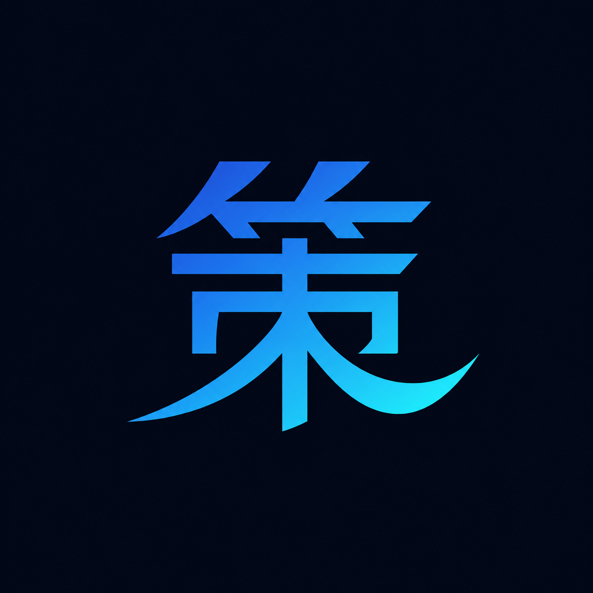

<div align="center">



# Saku

**An academic command center for students.** Tasks, schedules, study groups, and an AI assistant that actually does the work, wrapped in a dark, glassmorphic interface.

[](https://nextjs.org)
[](https://react.dev)
[](https://www.typescriptlang.org)
[](https://tailwindcss.com)
[](https://ui.shadcn.com)

</div>

---

## Overview

Saku is the web client for the Saku platform. It is a **client only Next.js app** that talks to a separate NestJS backend ([`saku-backend`](../saku-backend)) over a JSON API. Auth is JWT based, stored in `localStorage` and attached to every request by an axios interceptor.

Think of it as the surface where a student plans the week, watches deadlines close in, chats with study groups, and hands busywork to an AI agent that can create tasks and schedules on their behalf.

## Features

### Tasks
- Full CRUD with priority (Low / Medium / High), status (To Do / In Progress / Done), and progress.
- Board and list views, deadline tracking, overdue indicators.

### Scheduler
- **Calendar**, **Daily**, and **Timeline** views of events and deadlines.
- Create events inline (type, importance, color, time range) with client side validation.

### Study Groups and DMs
- Real time group and direct messaging over Socket.IO.
- Conversation list, history, presence, unread badges.

### Saku AI Assistant
- A floating, agentic chat wired to the backend `/agent` module.
- The agent uses tools to **read and mutate your real data**: it can list tasks, create schedules, check conflicts, and report what it did.
- Conversation history, optimistic message bubbles, markdown replies, tool action chips, and rotating "thinking" statuses.
- Kept deliberately separate from human chat: distinct identity, its own launcher bubble.

### Dashboard
- Stat cards, a productivity pulse radial, **Today's Flow**, an **Upcoming** schedule overview, and **Priority Focus** for deadlines inside 72 hours.

### Craft
- Dark glassmorphic surfaces over an animated **ethereal shadow** background.
- Indigo accent system, motion that respects `prefers-reduced-motion`, skeleton loading, and accessible focus states.

## Tech Stack

| Layer | Choice |
|---|---|
| Framework | Next.js 16 (App Router, Turbopack dev) |
| Language | TypeScript (strict) |
| UI | React 19, shadcn/ui on Radix primitives |
| Styling | Tailwind CSS v4, CSS variable design tokens |
| Motion | Framer Motion |
| Data | axios client against the NestJS API |
| Realtime | Socket.IO client |
| Charts | Recharts |
| Forms | React Hook Form + Zod |
| Markdown | react-markdown + remark-gfm |
| Dates | date-fns |

## Architecture

```
app/                 App Router routes (dashboard, tasks, scheduler, chat, settings, auth)
components/
  ui/                shadcn/ui primitives
  *.tsx              feature components (sidebar, scheduler, floating-assistant, ...)
hooks/               state + API per domain (use-auth, use-tasks, use-schedule, use-agent, ...)
lib/
  api-client.ts      axios instance with JWT interceptors
  api-config.ts      every backend endpoint, in one place
  types.ts           API types + backend->frontend normalizers
public/              static assets
```

State lives in **custom hooks**, one per domain, each owning its own loading, error, and data. No Redux, no global store. The hook layer also **normalizes the backend contract** (for example numeric `priority` and `deadline` are mapped to the canonical frontend shape), so components stay clean.

## Getting Started

### Prerequisites
- Node.js 18+
- [Bun](https://bun.sh) (this repo ships a `bun.lock`; npm or pnpm also work)
- The Saku backend running and reachable

### Setup

```bash
# 1. install
bun install

# 2. configure the API URL
cp .env.example .env.local      # then edit if needed

# 3. run
bun run dev                      # http://localhost:3000
```

> The app is useless without the backend. Start [`saku-backend`](../saku-backend) first.

### Scripts

| Command | Does |
|---|---|
| `bun run dev` | Dev server with Turbopack |
| `bun run build` | Production build |
| `bun run start` | Serve the production build |
| `bun run lint` | ESLint |

## Environment

Create `.env.local`:

```bash
# Base URL of the NestJS backend
NEXT_PUBLIC_API_URL=http://localhost:3001
```

The **AI assistant** also needs the backend configured with an OpenAI compatible LLM (`LLM_BASE_URL`, `LLM_API_KEY`, `LLM_MODEL`). Without it, `/agent/chat` returns 502 and the UI shows a graceful error.

## Routes

| Path | Screen |
|---|---|
| `/dashboard` | Overview: stats, today, upcoming, priority |
| `/tasks` | Task management |
| `/scheduler` | Calendar, daily, and timeline views |
| `/chat` | Study groups and direct messages |
| `/settings` | Profile and preferences |
| `/login`, `/register` | Auth |

## Conventions

- Add a backend endpoint to `lib/api-config.ts`, its types to `lib/types.ts`, then consume it from a hook.
- Add UI primitives with `npx shadcn@latest add <component>`; they land in `components/ui`.
- Keep the contract honest: if the backend response shape changes, update `lib/types.ts` and the normalizer, not the components.

---

<div align="center">
Built for students who would rather study than juggle tabs.
</div>
